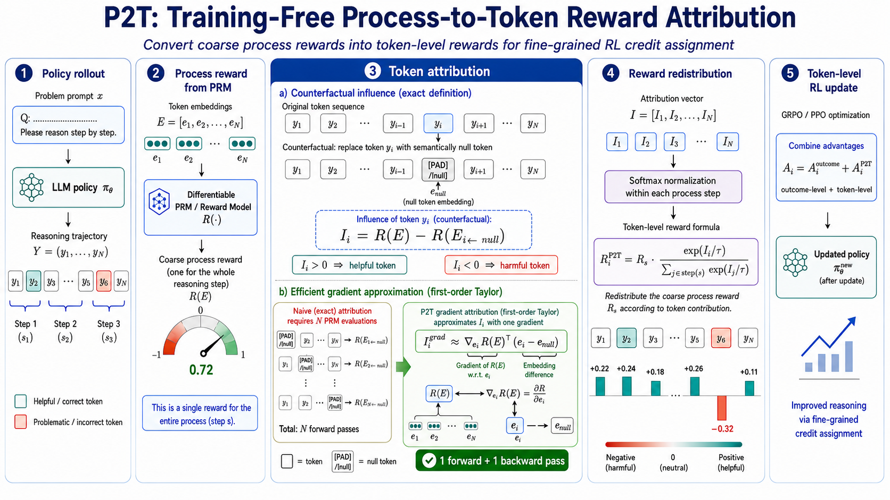

<div align="center">

# Unlocking Token Rewards via Training-Free Reward Attribution

**CVPR 2026**

Sitong Wu, Haoru Tan, Bin Xia, Xichen Zhang, Jingyao Li, Shaofeng Zhang, Xiaojuan Qi, Bei Yu, Jiaya Jia

[](https://openaccess.thecvf.com/content/CVPR2026/html/Wu_Unlocking_Token_Rewards_via_Training-Free_Reward_Attribution_CVPR_2026_paper.html)
[](https://github.com/stonewst/P2T)
[](https://github.com/volcengine/verl)

</div>

<p align="center">
  
</p>

## Introduction

**P2T (Process-to-Token)** is an extremely efficient, **training-free** method that extracts
**token-level reward signals directly from an existing well-trained reward model** (e.g., a Process
Reward Model, PRM), without training any additional token-level reward model.

The core idea is to **attribute a coarse macroscopic reward (the process reward) to individual
tokens** by estimating each token's *influence* — defined as the change in the final reward when
a token is replaced with a semantically **null token**. Computing this influence naively is
infeasible: it requires `N` forward passes through the PRM for an `N`-token sequence. P2T
overcomes this with a **gradient-based estimator**: a first-order Taylor approximation reduces the
influence to the inner product between

- the difference between the token embedding and the null-token embedding (`e_i − e_null`), and
- the gradient of the reward w.r.t. the token embedding (`∂R/∂e_i`).

$$
I_i \approx \big\langle\, e_i - e_{\text{null}},\ \tfrac{\partial R}{\partial e_i} \,\big\rangle
$$

This needs only a **single forward and backward pass**. The step reward `R_s` is then
redistributed within each reasoning step via a softmax over token influences
(`R_s · softmax(I)`), producing dense, semantically-aligned per-token rewards that plug directly
into standard RL algorithms (GRPO / PPO) for **precise credit assignment**.

**Highlights**

- 🚀 **Training-free**: no extra token reward model, no pseudo-labels — reuses an off-the-shelf PRM.
- ⚡ **Efficient**: `O(1)` cost — one forward + one backward pass per trajectory.
- 🎯 **Fine-grained**: turns a single step-level score into token-level credit assignment.
- 📈 **Effective**: `+4.9%` on MathVista (Qwen2.5-VL-7B-Instruct) and `+11.5%` on AIME24
  (Qwen2.5-Math-7B) over the outcome-reward baseline.

This repository implements P2T as a custom advantage estimator on top of
[**verl**](https://github.com/volcengine/verl).

## Installation

P2T follows the standard [verl](https://github.com/volcengine/verl) setup. We recommend follow the [official verl installation guide](https://verl.readthedocs.io/en/latest/start/install.html).

```bash
# 1. Create the environment
conda create -n p2t python=3.10 -y
conda activate p2t

# 2. Execute the install script that provided in verl

# If you need to run with megatron
bash scripts/install_vllm_sglang_mcore.sh   
# Or if you simply need to run with FSDP
USE_MEGATRON=0 bash scripts/install_vllm_sglang_mcore.sh

# 3. Clone the repository and install verl
git clone https://github.com/stonewst/P2T.git
cd P2T
pip install --no-deps -e .

```


## Training

### 1. Prepare the data

The training data is a `parquet` file (RL dataset format). A ready-to-use `MATH-12K` split is
provided under `data/MATH-12K/train.parquet`. You can preprocess your own dataset following the
examples in `examples/data_preprocess/`.

### 2. Prepare the models

- **Policy model**: any HuggingFace causal LM (e.g. `Qwen2.5-1.5B-Instruct`, `Qwen2.5-Math-7B`).
- **Process Reward Model (PRM)**: any step-level PRM whose step separator token is known
  (e.g. `Gen-Verse/ReasonFlux-PRM-7B` with separator `<extra_0>`).

### 3. Launch training

Edit the model / data paths in the example script, then run:

```bash
conda activate p2t
ray start --head
bash examples/p2t/qwen2.5-1.5b-instruct_MATH-12k.sh  # an example script
```


## Citation

If you find this work useful, please cite:

```bibtex
@InProceedings{Wu_2026_CVPR,
    author    = {Wu, Sitong and Tan, Haoru and Xia, Bin and Zhang, Xichen and Li, Jingyao and Zhang, Shaofeng and Qi, Xiaojuan and Yu, Bei and Jia, Jiaya},
    title     = {Unlocking Token Rewards via Training-Free Reward Attribution},
    booktitle = {Proceedings of the IEEE/CVF Conference on Computer Vision and Pattern Recognition (CVPR)},
    month     = {June},
    year      = {2026},
    pages     = {5082-5091}
}
```

## Acknowledgement

This codebase is built on top of the excellent [verl](https://github.com/volcengine/verl) RL
training library. We thank the verl team and community for their open-source contribution.

## Contact

For questions about the paper or code, please contact **Sitong Wu** at
[stonewst@163.com](mailto:stonewst@163.com), or open an issue on
[GitHub](https://github.com/stonewst/P2T).
